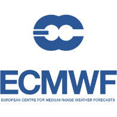

# qgis-ecmwf-catalogue-plugin
This plugin is an interface to the ECMWF data catalogue.

# Requirements
## Registration

You will need to first sign up with the ECMWF website:
http://apps.ecmwf.int/datasets/data/interim-full-daily/levtype=sfc/

You are then required to log into this page and create an access key:
[place holder for how to register and get API key]

## Visualising data
You will need QGIS (obviously) and Crayfish plugin to be able to view the data.
